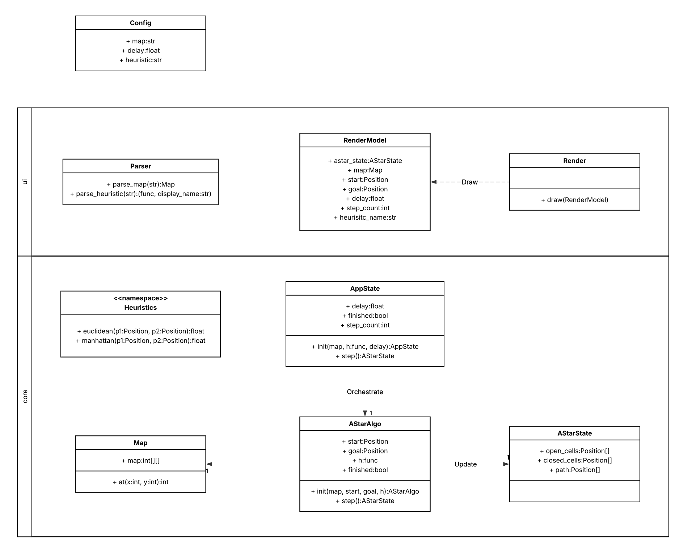

# Architecture

The system is organized into two main layers: **Core** and **UI/IO**.
This separation ensures that domain logic remains independent from input/output concerns.

---

## Core

The Core layer contains the domain logic and the A* pathfinding implementation.
It is fully decoupled from any form of input or rendering.

Responsibilities include:

* **A* algorithm execution** (incremental, step-by-step)
* **State management** of the search process (`AStarState`)
* **Grid representation** and access (`Map`)
* **Application orchestration** (`AppState`), coordinating the algorithm over time
* **Heuristic functions** used during pathfinding

This layer operates purely on structured data and does not depend on external systems.

---

## UI / IO

The UI/IO layer acts as the boundary between the system and the outside world.

Responsibilities include:

* **Parsing** raw user input (CLI arguments, map text, heuristic selection)
* **Transforming input into domain objects** (e.g., `Map`, heuristic functions)
* **Rendering** the current state of the algorithm in the terminal
* **Preparing presentation data** (`RenderModel`) for visualization

This layer does not contain business logic; it only adapts data for input and output.

---

## Design Principles

* **Separation of concerns**: Core and UI/IO are strictly decoupled
* **Incremental execution**: the algorithm advances one step per frame
* **Data-oriented rendering**: the renderer consumes a dedicated view model (`RenderModel`)
* **Pure domain logic**: no parsing or formatting leaks into the Core layer

---

## Class Diagram

